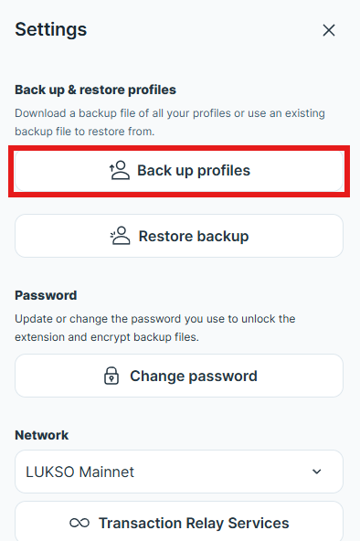

# Backup and Restore

<iframe width="560" height="315" src="https://www.youtube.com/embed/hyXIKU66cvc?si=maJqk5iY8N9uLY9B" title="YouTube video player" frameborder="0" allow="accelerometer; autoplay; clipboard-write; encrypted-media; gyroscope; picture-in-picture; web-share" referrerpolicy="strict-origin-when-cross-origin" allowfullscreen></iframe>

Backup and Restore feature of the Universal Profiles Browser Extension allows users to export all of their UPs to a password-protected file to be imported later.

:::info Available Recovery Options

Other safe options to restore your Universal Profile:

- Adding an e-mail or 2FA recovery feature via my.universalprofile.cloud
- Setting another wallet as a recovery controller, known as 3rd party wallet recovery

:::

## Backup Profiles

Some Text

More Text

### Backup with Protection (Recommended)

### Backup without Protection

## Restoring Backup
