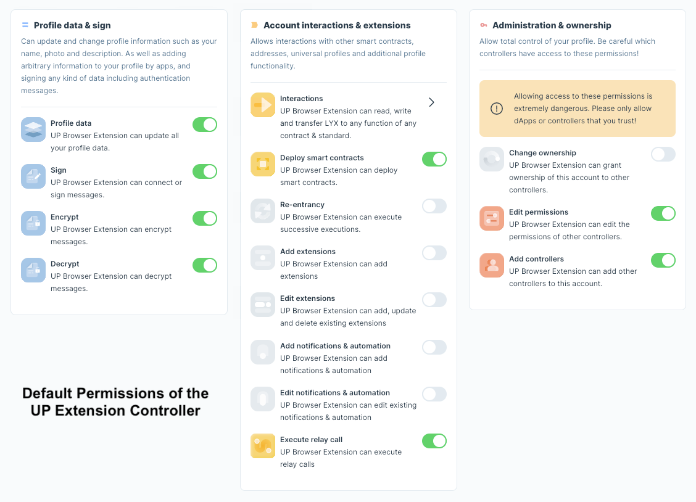
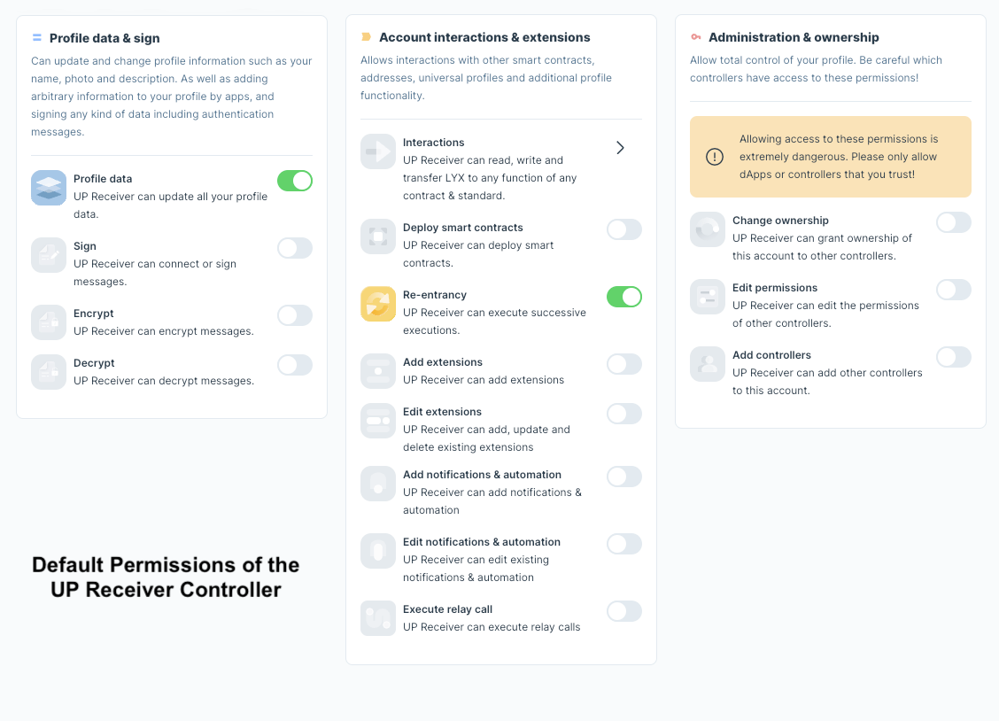
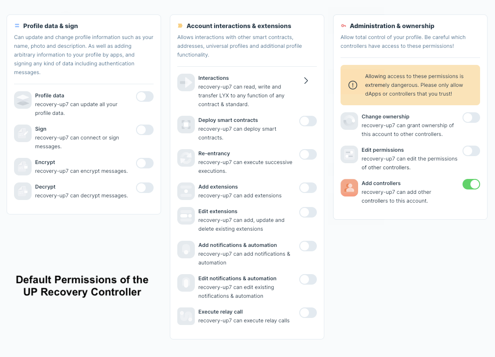

# Controllers

## What are the controllers of the Universal Profile?

Each Universal Profile within an extension holds a separate private key to send transactions on behalf of the user, e.g., controlling it. Such controllers can be exported, added, or removed. The controllers can be found within the **Controllers** window of the extension:

## Can I add 2FA recovery to an existing Universal Profile?

At the current state (11th January 2024), the 2FA recovery method from LUKSO can only be added during the creation of a Universal Profile on [UniversalProfile.cloud](https://universalprofile.cloud/).

:::success Upcoming Feature

Due to the [Controller Incident](./incidents/controller-recovery.md) of the Universal Profile Extension in January 2024, adding 2FA after the initial deployment will be added to the dashboard of [my.universalprofile.cloud](https://my.universalprofile.cloud/)

:::

## Can I use a regular wallet to control my Universal Profile?

As a developer, you can connect a regular wallet to the network where the Universal Profile was deployed and **manually add its EOA** as a controller. You will then have to send all transactions through the [Key Manager](https://docs.lukso.tech/standards/universal-profile/lsp6-key-manager../../standards/universal-profile/lsp6-key-manager) of the Universal Profile to execute them as your persona. However, we recommend directly using the [Universal Profile Extension](https://docs.lukso.tech/install-up-browser-extension) to interact with dApps on LUKSO.

## Can I use an existing EOA to control my Universal Profile?

You can add any new or existing Externally Owned Account as a controller to your deployed Universal Profile of a specific chain. This also includes already existing keys from wallets. However, please remember that your previous assets and token remain on the EOA address.

## What are the default permissions of the controllers?

If you want to reset the controller permissions to their initial state, you can set the permissions to the default values described in the following pictures:

    
Show default permissions of the Universal Profile Extension

    
Show default permissions of the Universal Receiver

    
Show default permissions of the Universal Profile Recovery

## Can I add a Ledger account as a controller of my profile?

Currently, we do _not officially support_ adding custom controllers to your Universal Profile. This can be done programmatically, but is not officially supported.

:::success Upcoming Feature

This question has been heard and the team is working on this [feature request](../general/feature-requests.md).

:::

## How can I remove controllers and permissions?

To remove permissions, use the extension to view all controllers with permissions on the profile. You can toggle off permissions individually. If you want to remove the controller, please toggle off every permission. Controllers with _no permissions will be hidden within_ the extension.

:::success Upcoming Feature

The team is currently working on a [feature request](../general/feature-requests.md) to _completely remove old controllers_, not only their individual permissions. This also includes _showing hidden controllers_ again.

:::

:::caution Changing Permissions

Be cautious when modifying permissions, as this might restrict access for recovery methods or extensions. For reference, you can look at the [default permissions](#what-are-the-default-permissions-of-the-controllers) of all the different controllers.

:::
