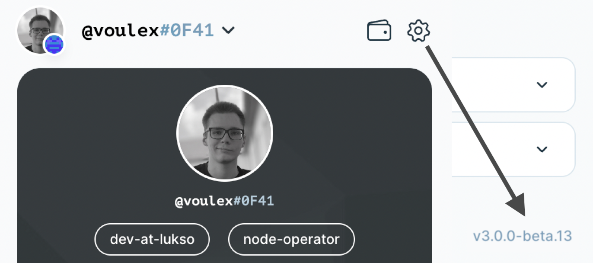

# Check Extension Version

To check your extension version, open the settings of the extension at the upper right corner. Then scroll all the way down to retreive the current version of your browser extension.

