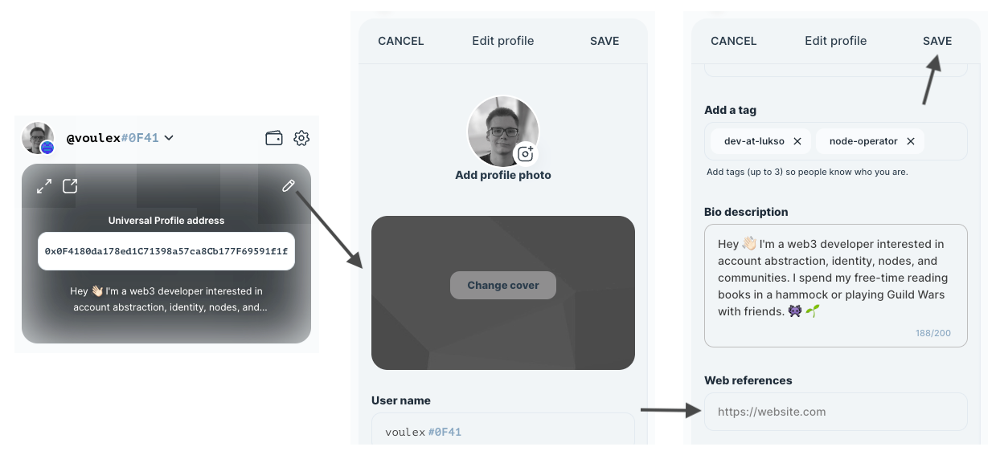

# FAQ

## Does LUKSO have a grants program?

Yes, absolutely! Please go to our main [grants program page](https://lukso.network/grants) for more information and to apply!

## Why can't I delete my old private keys?

At the moment, the Universal Profile Browser Extension only allows to disable permissions of old controller keys. If you want to improve security, please disable all permissions of an old controller. You can learn more within the [Controllers](../../Extension/controllers.md) page. Soon, there will be a feature to manually remove controllers completely.

## Why I can't I see all my controllers?

If you remove all permissions of a controller, it will be automatically hidden within the extension. If you want to temporarily disable some permissions of a controller, please leave one minor permission set for now. This behavior will be changed within the future.

## Why can't I delete profiles from the extension?

Right now, you can not remove profiles from the dashboard on [my.universalprofile.cloud](https://my.universalprofile.cloud/) or the Universal Profile Extension. Soon, there will be a feature to clean old profiles.

## Why does my NFT not show up on UniversalProfile.cloud?

If your deployed assets do not appear on your profile on [universalprofile.cloud](https://universalprofile.cloud/), they may be using outdated InterfaceIDs from deprecated LSP versions. Ensure you are using up-to-date [LSP Interface IDs](https://docs.lukso.tech/contracts/interface-ids) as defined in the [lsp-smart-contracts](https://www.npmjs.com/package/@lukso/lsp-smart-contracts) library.

## Why does my profile show as anonymous?

Due to some changes in how data is added to the Universal Profile in the early days, it might happen that your profile does not have a name to it or shows completely anonymous on [universalprofile.cloud](https://universalprofile.cloud/) without any pictures. If you experience such an issue, please **edit and deploy your profile metadata** again within the Universal Profile Browser Extension as shown in the following picture:

