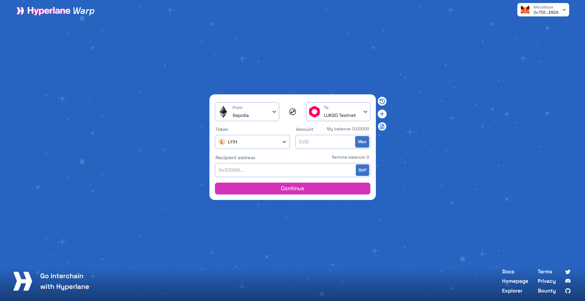

import ImportTokenSection from '@site/src/components/ImportTokenSection'

# Use the LUKSO Bridge

LUKSO uses the Hyperlane Warp UI for the bridging tokens to/from LUKSO Mainnet.

## Prerequisites

Before using the bridge, ensure you have:

1. **A Web3 Wallet**: MetaMask, Rabby, or another compatible wallet
2. **Network Configuration**: The correct network added to your wallet
3. **Gas Fees**: Native tokens of the destination network to manage your bridged tokens.

## How to Bridge Tokens

1. **Visit [_Hyperlane Warp UI_](https://lukso-bridgev1.pages.dev/)** : Make sure to visit the official webpage
2. **Connect Your Wallet**: Connect your Web3 wallet to the bridge interface
3. **Select Networks**: Choose the **from**(source) and **to**(destination) networks
4. **Enter Amount**: Specify the amount of tokens to bridge
5. **Confirm Transaction**: Review and confirm the transaction in your wallet
6. **Wait for Confirmation**: Bridge transactions typically take a few minutes
7. **Import Token**: Use the buttons [**below**](#import-lyx-to-wallet) to add the bridged token to your wallet

:::tip Import Bridged Tokens to Your Wallet

After bridging tokens, you need to **import LYX to your wallet** to see your balance.

:::

## Import LYX to Wallet

Click the buttons below to add the bridged LYX tokens to your wallet:

<ImportTokenSection />

## Important Notes

- Bridge transactions are irreversible - double-check all details before confirming
- Keep some native tokens for gas fees on both networks
- Bridging times may vary depending on network congestion
- Always verify contract addresses when manually adding tokens
