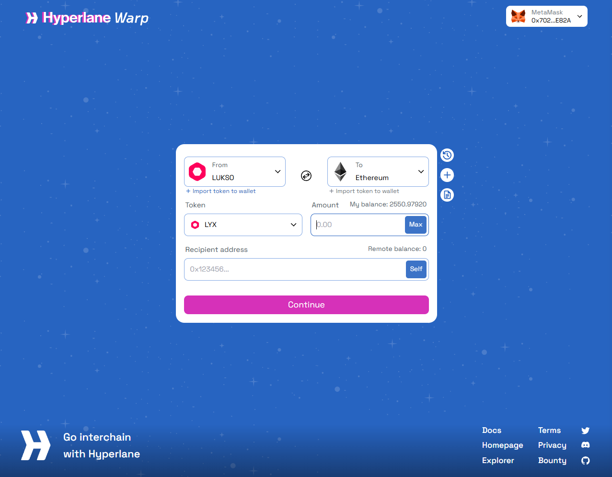
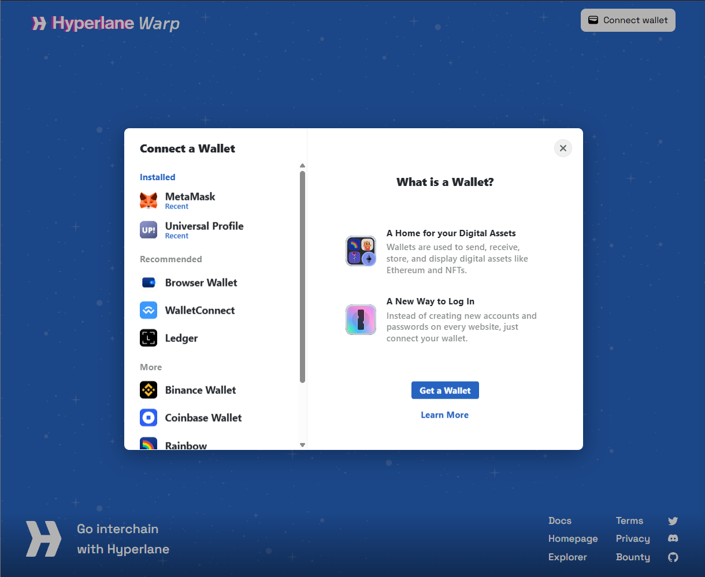

import ImportTokenSection from '@site/src/components/ImportTokenSection'
import Tabs from '@theme/Tabs';
import TabItem from '@theme/TabItem';

# Use the LUKSO Bridge

This guide is for understanding how bridging works <strong>from</strong> and <strong>to</strong> LUKSO Network.

## Prerequisites

Before using the bridge, ensure you have:

1. **A Web3 Wallet**: MetaMask, Rabby, or another compatible wallet
2. **Network Configuration**: The correct network added to your wallet
3. **Native Tokens for**:
   - the amount you want to bridge
   - to pay for the gas fees
   - to pay for the processing fee (Interchain Gas Payment)

## How to Bridge Tokens

**Visit [_Hyperlane NEXUS_](https://usenexus.org/) page** : Make sure to visit the official webpage:

:::info
LUKSO uses the Hyperlane's NEXUS Bridge for the bridging to/from LUKSO Mainnet.
:::

:::danger Important

As Universal Profiles are currently only available on LUKSO, please do not enter a UP address as the <strong>recipient</strong> when bridging from LUKSO to other networks.

:::

### Are you ⤵️

<Tabs>
  <TabItem value="eoa" label={<h3>🌉 Bridging from another Web3 wallet?</h3>} default>

1. **Connect Your Wallet**: Connect your Web3 wallet (MetaMask, Rabby, etc.) to the bridge interface
   

---

2. **Select Networks**: Choose the **from**(source) and **to**(destination) networks
   

---

3. **Select Tokens from the dropdown list**: Select **LYX**
   

---

4. **Enter Amount**: Specify the amount of tokens to bridge
   

---

5. **Enter the Recipient Address**: Input the destination wallet address where tokens will be sent. Use the <strong>Self</strong> button if you're going to use the same wallet on the destination network.

:::danger Using UP address as a recipient

If you are not bridging <strong>to LUKSO</strong>, please do not use a Universal Profile address as a recipient!
:::

---

6. **Confirm Transaction**: Review and confirm the transaction in your wallet

   

---

7. **Follow your status**: Bridge transactions typically take a few minutes

:::tip Check your status
Visit [Hyperlane Explorer](https://explorer.hyperlane.xyz/) with your Message ID to see the status of your transaction.
:::

---

8. **Import Token**: Use the buttons [**below**](#import-bridged-lyx-hyperlane) to add the bridged token to your wallet

  </TabItem>
  <TabItem value="up" label={<h3>Bridging from a 🆙?</h3>}>

1. **Connect Your Universal Profile**: Connect your UP through the Universal Profile Extension
   

---

2. **Select Networks**: Choose the **from**(source) and **to**(destination) networks
   

---

3. **Select Tokens from the dropdown list**: Select **LYX**
   

---

4. **Enter Amount**: Specify the amount of tokens to bridge
   

---

5. **Enter the Recipient Address**: Input the destination address

:::danger Important

As Universal Profiles are on LUKSO, please do not enter a UP address as recipient when bridging from LUKSO! This action might cause to lose your tokens.

:::

---

6. **Confirm Transaction**: Review and approve the transaction using your Universal Profile
   

---

7. **Follow your status**: Bridge transactions typically take a few minutes

:::tip Check your status
Visit [Hyperlane Explorer](https://explorer.hyperlane.xyz/) with your Message ID to see the status of your transaction.
:::

---

8. **Import Token**: Use the buttons [**below**](#import-bridged-lyx-hyperlane) to add the bridged token to your wallet

  </TabItem>
</Tabs>

:::tip Import Bridged Tokens to Your Wallet

After bridging tokens, you need to **import Bridged LYX to your wallet** to see your balance.

:::

## Import Bridged LYX (Hyperlane)

Bridged LYX (Hyperlane) is an ERC20 token on Ethereum. It needs to be imported in your wallet and will be visible under your list of tokens.

<ImportTokenSection />

## Important Notes

- Bridge transactions are irreversible - double-check all details before confirming
- Keep some native tokens for gas fees on both networks
- Bridging times may vary depending on network congestion
- Always verify contract addresses when manually adding tokens
