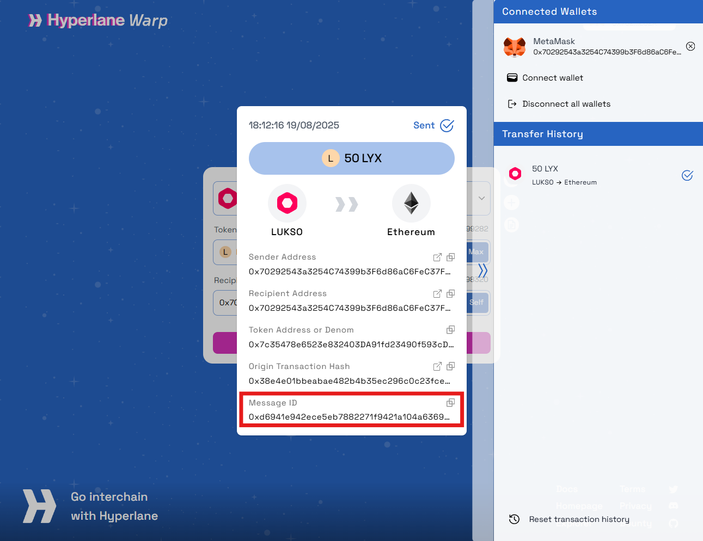

import ImportTokenSection from '@site/src/components/ImportTokenSection'
import Tabs from '@theme/Tabs';
import TabItem from '@theme/TabItem';

# Use the LUKSO Bridge

<iframe width="560" height="315" src="https://www.youtube.com/embed/U_8Zlhk7aPU?si=Mc9Eo_2coY7LcNCm" title="YouTube video player" frameborder="0" allow="accelerometer; autoplay; clipboard-write; encrypted-media; gyroscope; picture-in-picture; web-share" referrerpolicy="strict-origin-when-cross-origin" allowfullscreen></iframe>

This page will guide you on how to use the Hyperlane NEXUS dApp to bridge assets from and to the LUKSO Network.

:::danger Warning

**When bridging from LUKSO to other chains, DO NOT enter a UP address as the `recipient`**.

Otherwise, you will lose access to your bridged tokens on Ethereum (or the destination chain you have selected). This is because Universal Profiles are currently only available on the LUKSO network.

:::

## Prerequisites

Before using the Hyperlane bridge, ensure you have:

1. **A Web3 Wallet**: MetaMask, Rabby, or any other compatible EVM wallet.
2. **Network Configuration**: The correct network added to your wallet.
3. **Native Tokens** (Ethereum mainnet requires ETH, LUKSO Mainnet requires LYX):
   - to pay for the gas fees
   - to pay for the processing fee ([Interchain Gas Payment](https://docs.hyperlane.xyz/docs/protocol/core/interchain-gas-payment#interchain-gas-payments))

  
What is the Interchain Gas Payment?

When performing a bridge transaction, Hyperlane require users to pay a processing fee called an _“interchain gas payment”_ (IGP) in the form of native tokens.

These funds go directly to Hyperlane relayers that use them to pay for the gas fee when processing the final bridge transaction on the destination chain.

Users can see the IGP amount required to pay in the UI before confirming the bridge transaction.

Note that these fees are not accumulated by any specific parties. They are cross-chain bridging fee part of the Hyperlane cross-chain messaging protocol and solely used for processing bridge transactions.

## Go to [_Hyperlane NEXUS Bridge dApp_](https://usenexus.org/?origin=lukso&destination=ethereum&token=0xC210B2cB65ed3484892167F5e05F7ab496Ab0598)

:::info
LUKSO uses the Hyperlane NEXUS Bridge dApp for bridging from/to LUKSO Mainnet.

**Make sure to visit the official webpage at** [https://usenexus.org](https://usenexus.org)
:::

## How to bridge?

<Tabs>
  <TabItem value="eoa" label={<h3>👝 Bridging from a web3 wallet</h3>} default>

**1. Connect Your Wallet**: Connect your Web3 wallet (MetaMask, Rabby, etc.) to the bridge interface by selecting `Ethereum` on the `Connect Wallet` menu:

:::info

Make sure you have the [LUKSO Mainnet added to your network in your wallet](/general/supported-wallets/wallet-support.md#is-there-a-faster-way).

:::

**2. Select Networks**: Choose the **from** (source) and **to** (destination) networks

**3. Select Tokens from the dropdown list**: Select **`LYX`**

**4. Enter Amount**: Specify the amount of tokens to bridge

**5. Enter the Recipient Address**: Input the address of the wallet that will receive the tokens on the destination chain. You can also use the <strong>Self</strong> button if you want to bridge to the same wallet on the destination network.

:::danger Using UP address as a recipient

If you are bridging from LUKSO -> to Ethereum (or any other chain), **DO NOT use a Universal Profile address as `recipient`!** This would lead to losing access to your bridged tokens on the destination chain.

:::

**6. Confirm Transaction**: Review and confirm the transaction in your wallet

**7. Follow the status of your bridge transaction**: Bridge transactions typically take a few minutes

:::tip Check the status of your transaction

Visit the [🔍 Hyperlane Explorer](https://explorer.hyperlane.xyz/?origin=lukso), select LUKSO as _"Origin"_ and paste your Message ID to find your bridge transaction and see its status (if it is still being processed or it has been delivered on the destination chain).

:::

  </TabItem>
  <TabItem value="up" label={<h3>🆙 Bridging from a Universal Profile</h3>}>

:::warning Interchain Gas Payment Fee

While the relayer pay for the gas (transaction fee), you must have sufficient LYX in your Universal Profile to cover the **[Interchain Gas Payment](#prerequisites)** (processing fee).

:::

**1. Connect Your Universal Profile**: Connect your UP through the Universal Profile Extension by selecting `Ethereum` on the `Connect Wallet` menu:

**2. Select Networks**: Choose the **from**(source) and **to**(destination) networks

**3. Select Tokens from the dropdown list**: Select **`LYX`**

**4. Enter Amount**: Specify the amount of tokens to bridge

**5. Enter the Recipient Address**: Input the destination address

:::danger Using UP address as a recipient

If you are bridging from LUKSO -> to Ethereum (or any other chain), **DO NOT use a Universal Profile address as `recipient`!** This would lead to losing access to your bridged tokens on the destination chain.

:::

**6. Confirm Transaction**: Review and approve the transaction using your Universal Profile

**7. Follow the status of your bridge transaction**: Bridge transactions typically take a few minutes

:::tip Check the status of your transaction

Visit the [🔍 Hyperlane Explorer](https://explorer.hyperlane.xyz/?origin=lukso), select LUKSO as _"Origin"_ and paste your Message ID to find your bridge transaction and see its status (if it is still being processed or it has been delivered on the destination chain).

:::

  </TabItem>
</Tabs>

## Import `Bridged LYX` to your wallet

`Bridged LUKSO (Hyperlane)` (token symbol: `LYX`) is an ERC20 token on Ethereum. After bridging, you need to **import this token to your wallet** to see it under your list of tokens and to see your updated balance.

Use the buttons [**below**](#import-wlyx-to-wallet) to add the bridged token easily to your wallet.

<ImportTokenSection />

## Important Notes

- Bridge transactions are irreversible - double-check all details before confirming
- Keep some native tokens for gas fees on both networks
- Bridging times may vary depending on network congestion
- Always verify contract addresses when manually adding tokens
