# Use the Token Creator

<iframe width="560" height="315" src="https://www.youtube.com/embed/wveXdqB0pNk?si=M7bEFMMEfwxtu8uR" title="YouTube video player" frameborder="0" allow="accelerometer; autoplay; clipboard-write; encrypted-media; gyroscope; picture-in-picture; web-share" referrerpolicy="strict-origin-when-cross-origin" allowfullscreen></iframe>

This guide explains how to create tokens and NFTs using the **Token Creator** on [**Universal Everything**](https://universaleverything.io/).  
It covers how to set up, choose token types, add metadata, and manage created tokens.

## Overview

The **Token Creator** allows you to:

- Create and deploy tokens or NFTs without writing code
- Define categories, metadata, and co-creators
- Manage and update tokens directly from your **Universal Profile**

This process provides a straightforward way to issue on-chain assets such as proof of attendance for events, collectibles, memberships, and digital items.

## Accessing the Token Creator Tool

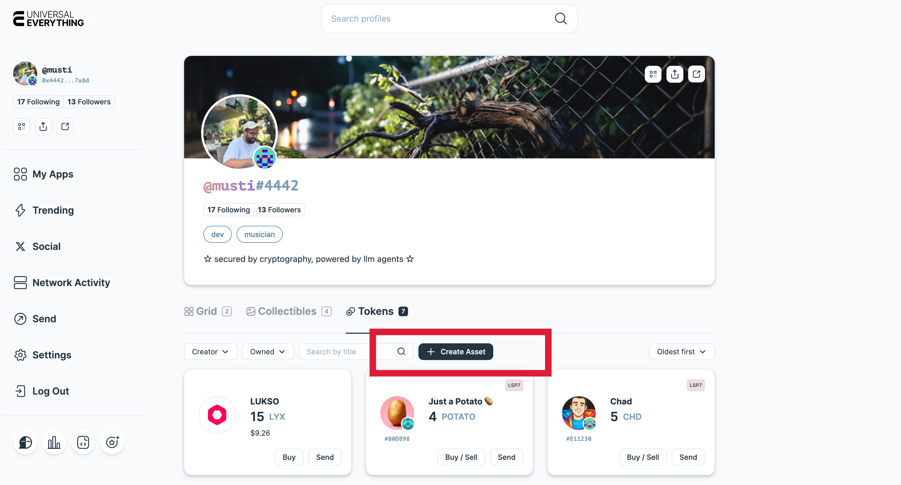

1. Go to **[Universal Everything](https://universaleverything.io/)**.
2. Connect your **Universal Profile** and visit your profile page.
3. On the Tokens tab, select **Create Asset**.

## Creating a Token

Follow these steps to create a new token:

### 1. Enter Token Details

Fill in the basic information for your token:

| Field                   | Description                                                          |
| ----------------------- | -------------------------------------------------------------------- |
| **Name\***              | The display name of your token (e.g., MyCustomToken, Fan Token)      |
| **Symbol\***            | Short identifier (e.g., MCT, FAN).                                   |
| **Category**            | The token type of the asset ([more details](#2-choosing-a-category)) |
| **Initial Mint Amount** | Initial amount of the created asset.                                 |

:::warning \*Token name and Symbol
Note that the `Name` and the `Symbol` values can not be changed later.
:::

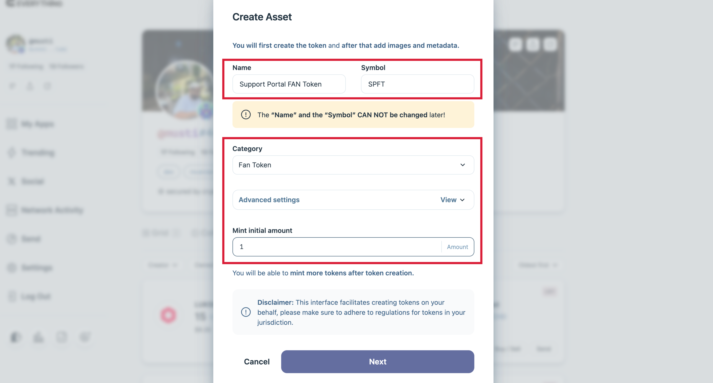

### 2. Choosing a Category

Select what your token represents. Examples include:

- Fan Token
- Proof of Attendance
- Utility Token
- Collectible
- Membership

The system automatically pre-selects the appropriate token type (LSP7 or LSP8), but you can change it if needed.

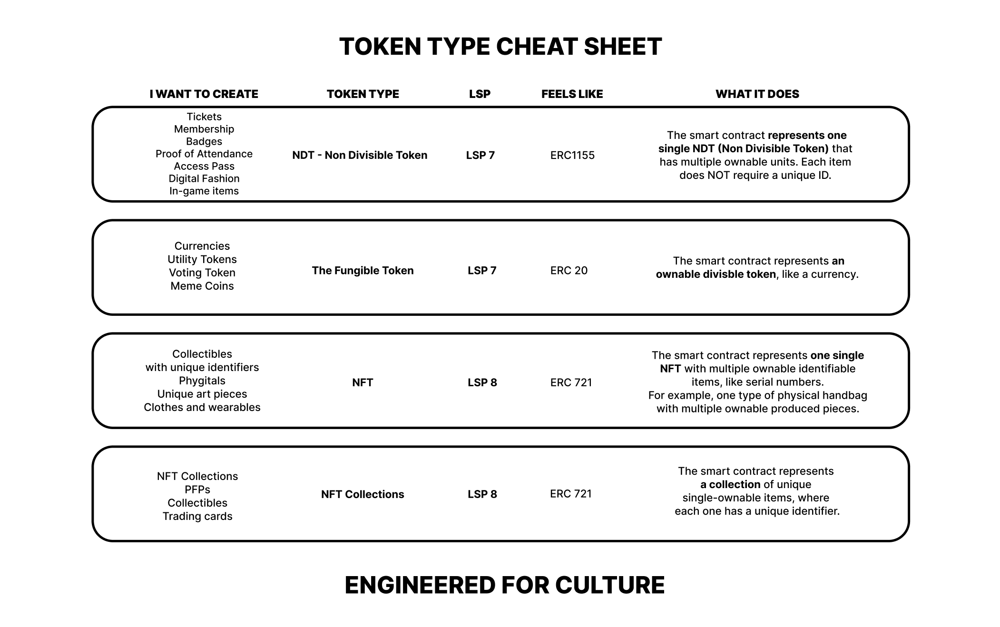

### 3. Review and Create!

Review the entered information and click **Create**.
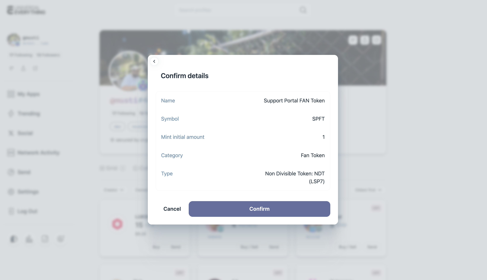

Sign the transactions from your Universal Profile to confirm deployment.
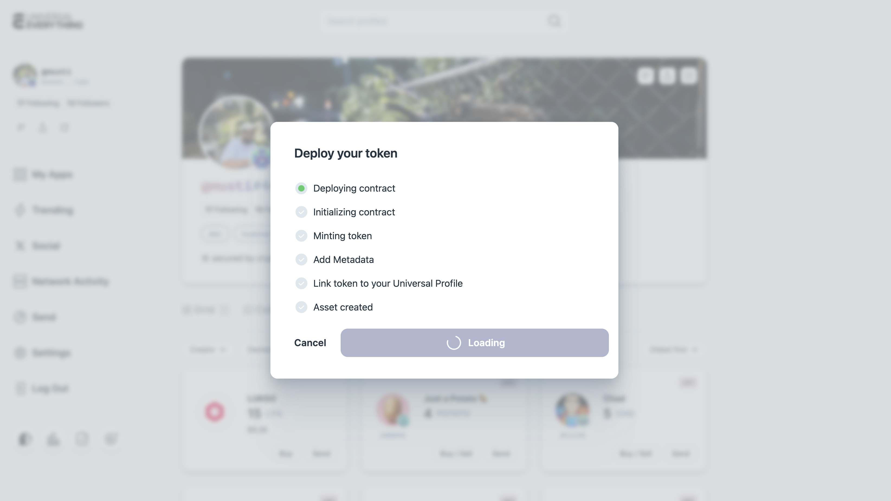

After confirmation, the token will appear under your profile.
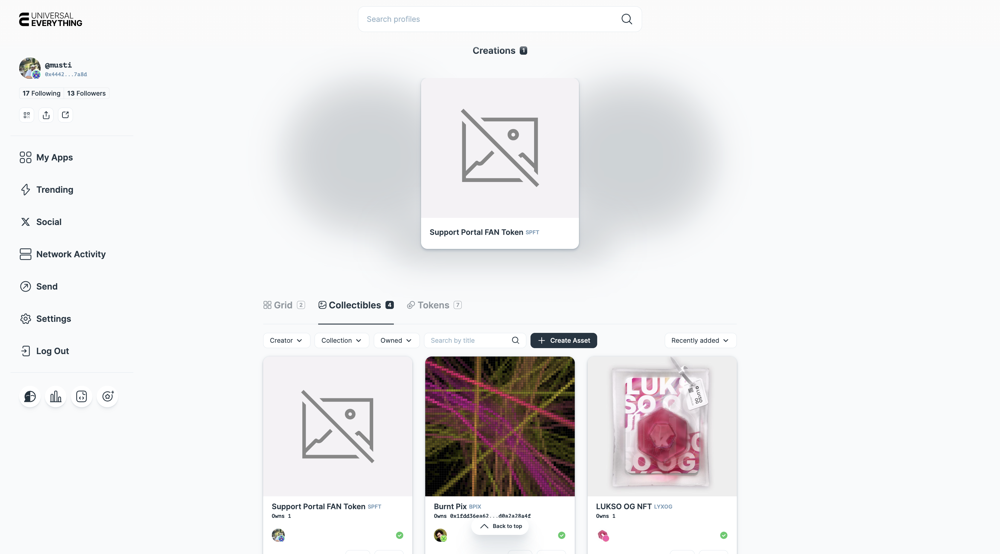

## Managing Tokens

After creation, you can manage your token through your asset page on **Universal Everything**.

Simply click the **Edit** icon to start managing your tokens:

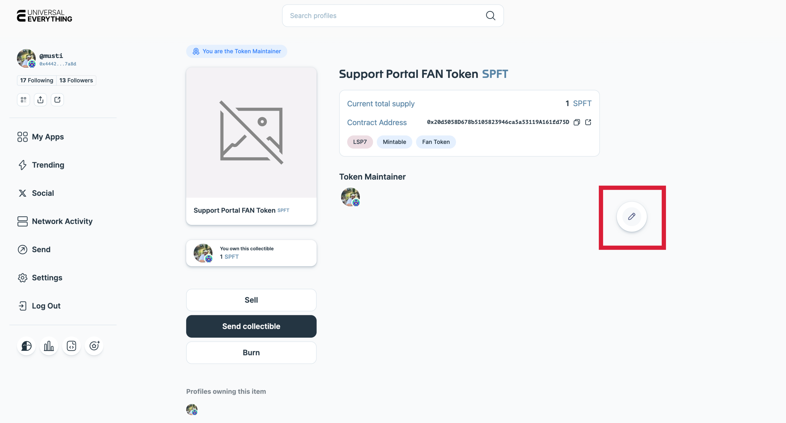

### Edit Token Metadata

When edit mode is enabled, it is possible to add more metadata to your token such as **image**, **description**, **external links**, and **assets** of your token.

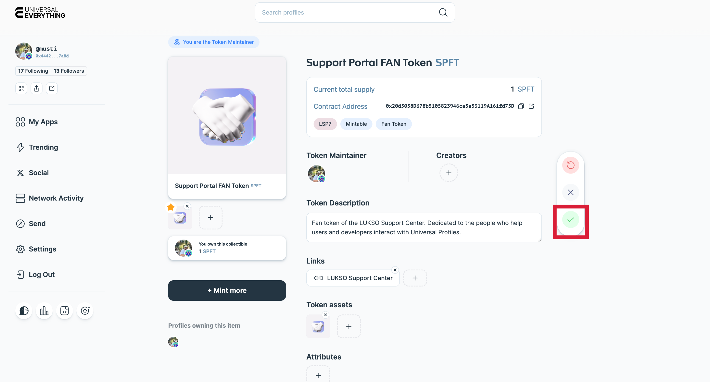

Once you are done with entering details, click **Save** icon to add these details to your token.

### Mint & Burn Tokens

**a. Mint More Tokens**

- It is possible to mint more tokens when **Edit** mode is enabled:

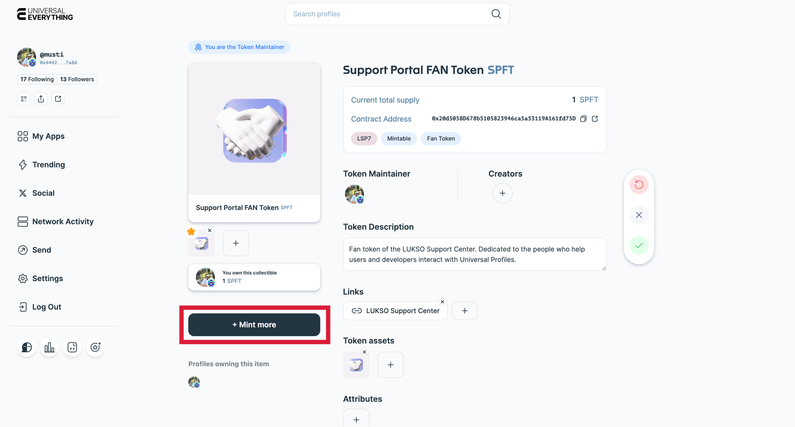

- You can either mint it to your Universal Profile, or to an another UP by searching it's name!

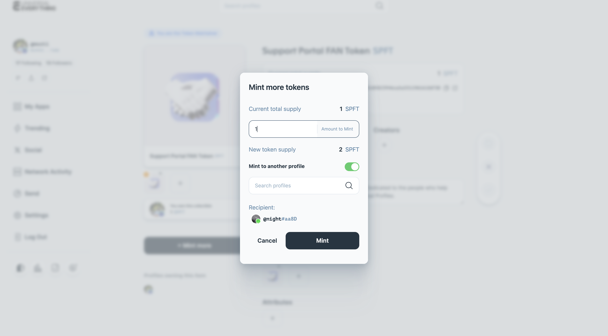

**b. Burn Tokens**

- It is possible to burn the tokens you created on the token page directly without switching to Edit mode.

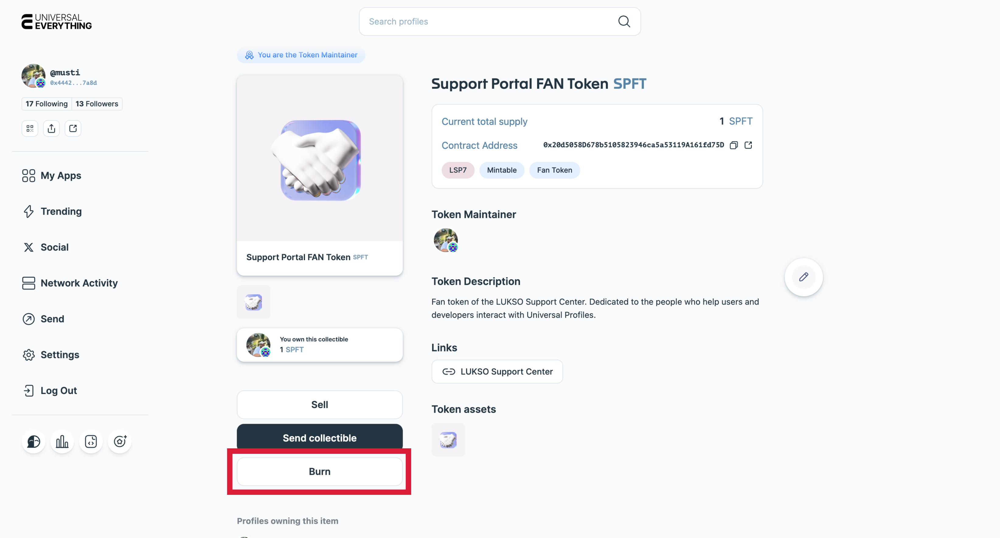

:::warning Zero Address

Burning the tokens would send them to **zero address(0x....dead)**, meaning that they are irrecoverable once sent.

:::

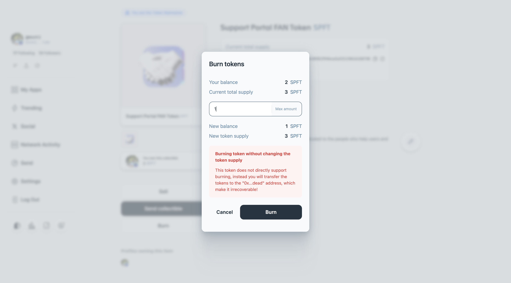

### Add Co-Creators

You can add one or more co-creators by selecting their **Universal Profiles**.  
Co-creators are recorded on-chain as part of the token’s provenance.

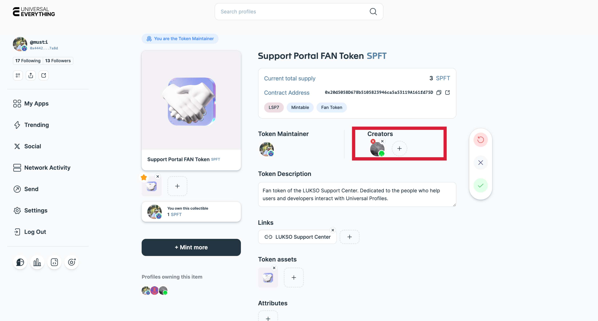

## Troubleshooting

| Issue                                              | Solution                                                                                                                                                                                                                                                                                       |
| -------------------------------------------------- | ---------------------------------------------------------------------------------------------------------------------------------------------------------------------------------------------------------------------------------------------------------------------------------------------- |
| Insufficient LYX                                   | If you are using the extension controller, make sure you have enough funds on the controller address. [See this guide for funding your controller](../../Extension/guides/fund-controller.md).                                                                                                 |
| Wrong network                                      | Switch your Universal Profiles Browser Extension to the intended network and reload. If you are using an EOA Wallet to interact with, [make sure you added LUKSO Mainnet](../../general/supported-wallets/wallet-support.md#how-do-i-add-lukso-to-my-wallet) to your wallet as custom network. |
| Transaction stuck                                  | Check the activity tab of your Universal Profiles Browser extension to see it's status. Get back to the Token Creator tool to continue your progress.                                                                                                                                          |
| Media not updating / Token is not showing under UP | Clear your browser's cache and/or wait for indexers to catch up with latest data.                                                                                                                                                                                                              |

## Need Help?

If you encounter other issues while creating tokens, you can reach out for support through **support@lukso.network**!
