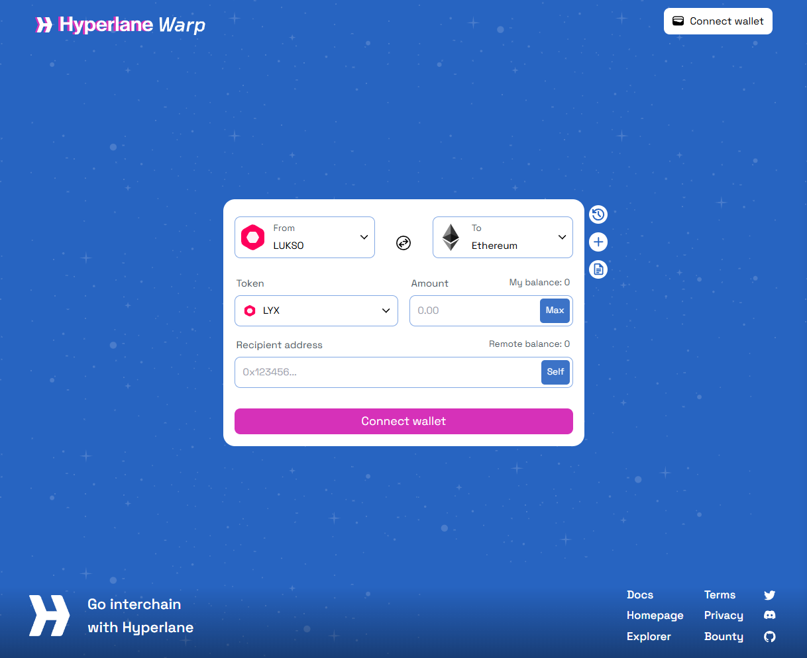

# Use the Token Creator

This guide explains how to create tokens and NFTs using the **Token Creator** on [**Universal Everything**](https://universaleverything.io/).  
It covers how to set up, choose token types, add metadata, and manage created tokens.

## Overview

The **Token Creator** allows you to:

- Create and deploy tokens or NFTs without writing code
- Define categories, metadata, and co-creators
- Manage and update tokens directly from your **Universal Profile**

This process provides a straightforward way to issue on-chain assets for events, collectibles, memberships, and digital items.

---

## Accessing the Token Creator Tool

1. Go to **Universal Everything**.
2. Connect your **Universal Profile** and visit your profile.
3. On the Tokens tab, select **Create Asset**.

---

## Creating a Token

Follow these steps to create a new token.

### Enter Token Details

Fill in the basic information for your token:

| Field                   | Description                                                              |
| ----------------------- | ------------------------------------------------------------------------ |
| **Name\***              | The display name of your token.                                          |
| **Symbol\***            | Short identifier (e.g., LYX, FAN).                                       |
| **Category**            | The token type of the asset ([more details](#step-2--choose-a-category)) |
| **Initial Mint Amount** | Initial amount of the created asset.                                     |

:::warning \*Token name and Symbol
Note that the `Name` and the `Symbol` values can not be changed later.
:::

### Choosing a Category

Select what your token represents. Examples include:

- Fan Token
- Proof of Attendance
- Utility Token
- Collectible
- Membership

The system automatically pre-selects the appropriate token type (LSP7 or LSP8), but you can change it if needed.

**Token Type Reference table**:

| Token Type                    | Standard | Typical Use                              | Description                                             |
| ----------------------------- | -------- | ---------------------------------------- | ------------------------------------------------------- |
| **Fungible Token**            | LSP7     | Community points, currencies, governance | Interchangeable tokens. All units are equal.            |
| **Non-Divisible Token (NDT)** | LSP7     | Event tickets, badges, memberships       | Identical tokens with shared properties, no unique IDs. |
| **NFT**                       | LSP8     | Artworks, credentials, dynamic media     | Each token has a unique ID and metadata.                |
| **NFT Collection**            | LSP8     | PFPs, digital fashion, grouped items     | A set of unique NFTs organized within one collection.   |

### Review and Create!

1. Review the entered information.
2. Click **Create**.
3. Sign the transactions from your Universal Profile to confirm deployment.

After confirmation, the token will appear under your profile.

## Managing Tokens

After creation, you can manage your token through your asset page on **Universal Everything**.

Simply click the **Edit** button to start managing your tokens:

### Edit Token Metadata

### Mint & Burn Tokens

### Add Co-Creators

You can add one or more co-creators by selecting their **Universal Profiles**.  
Co-creators are recorded on-chain as part of the token’s provenance.

## Need Help?

If you encounter issues while creating tokens, you can reach out for support through **support@lukso.network**!
