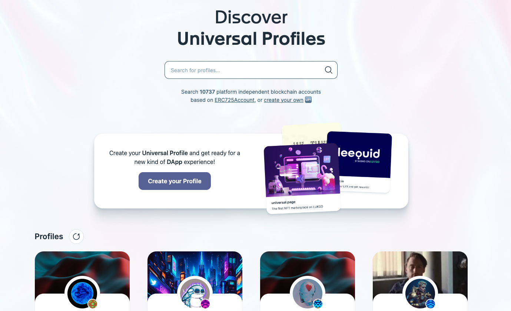
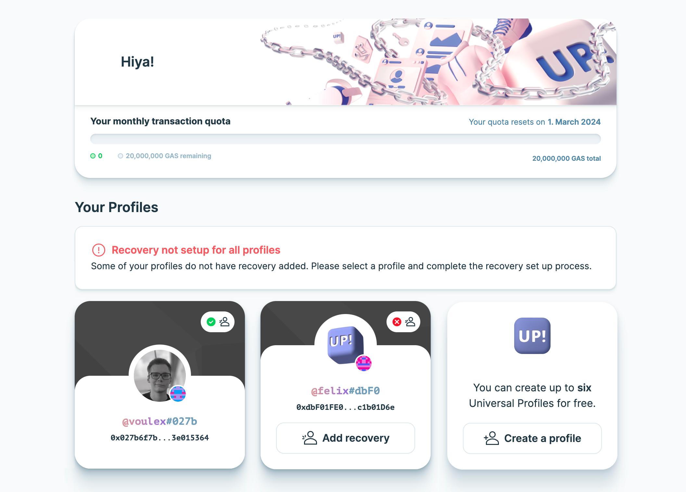

import React from 'react'
import LoomVideo from '../../src/components/LoomVideo'

# Universal Profiles

## Where can I see my Universal Profile ?

You can find your Universal Profile on the Universal Profile Explorer at [universalprofile.cloud](https://universalprofile.cloud/). Just select the correct network on the bottom left corner and use the global search bar to search for your name.

## How can I send assets from my Universal Profile?

The Universal Profile Extension **does not directly manage token information**. Instead, it is designed to work with various decentralized applications (dApps) that can seamlessly integrate with your Universal Profile and interact with its information and controllers. You can connect your Universal Profile to [wallet.universalprofile.cloud](https://wallet.universalprofile.cloud/) to send token transactions.

<LoomVideo src="https://www.loom.com/embed/47b4f4e671b248219cac48726358a791?sid=a88bd596-8860-4677-83c9-33384ccfdcb1" />

## Where can I manage my Universal Profile?

You can connect your Universal Profile to [my.universalprofile.cloud](https://my.universalprofile.cloud/) to check and add 2FA recovery or create new profiles.

## Is my Universal Profile name unique?

The profile name displayed on platforms and services is retrieved from the metadata linked to the smart contract. Such metadata, images, or descriptions can be individually set when creating or updating the Universal Profile. Therefore, multiple users can choose similar names or pictures.

What is unique about a Universal Profile are its address and the identicon. The address is indicated with the first four characters behind the profile name. In case the first characters of the address should be similar or identical, the identicon further helps to distinguish them. The combination of attributes was done to allow complete customization without lacking authentication.

## Can I send Ether and Token from Ethereum to my Universal Profile?

You can't send any assets to the address if you do not deploy the Universal Profile on Ethereum. Users will lose their assets if they send them to other networks without having access to the controller key.

:::danger LYXe Transactions

You can not send aquired LYXe directly to your Universal Profile address, as LYXe is deployed on Ethereum, but Universal Profiles are deployed on LUKSO. Please migrate your LYXe to LYX first using the [LUKSO Migration Service](https://migrate.lukso.network/). For further details, please visit the [Migration Support](../migration/introduction.md) page.

:::

## Which tokens and coins can my Universal Profile hold?

A Universal Profile can hold any asset on the same network it's deployed on. On LUKSO, the native coin is LYX. While native coins from other networks can't be held directly in Universal Profiles deployed on LUKSO, external services might also create token bridges for external assets.

## Can I control assets using Universal Profiles on any blockchain?

You can manage your assets through a Universal Profile on any blockchain the contract is deployed on. This would also include cases where the standardization was rewritten in a different language. If a service or project would allow you to create Universal Profiles on Ethereum, you could manage your assets through it.

## Why do Universal Profile transactions show up as internal transactions?

The Universal Profile is a **smart contract**. Unlike a regular wallet, where _transactions are made directly by the address owning the funds_, the transactions on the Universal Profile are **executed by one of it's controllers**. This division of execution and ownership of assets requires the execution of custom logic of the smart contract. The key manager has to check the permissions of the controller, before any on-chain action is made. This additional logic, established using [LSP smart contracts](https://docs.lukso.tech/standards/introduction) is the reason for transactions appearing as internal.

## Is it possible to create a profile with the same address as my wallet?

The Universal Profile is a smart contract account deployed using a regular wallet key (EOA). Hence it _cannot overwrite or have the same address as an existing browser- or hardware wallet_.

## How can I delete profiles on the explorer?

Currently, there's no way to delete profiles showing up on [universalprofile.cloud](https://universalprofile.cloud/) if you lost access or the deployment was not completed. To delete a profile that you can still access within the Universal Profile Browser Extension, please edit the metadata and remove all the contents like pictures and names.

:::success Upcoming Feature

Removing profiles [is planned](./feature-requests.md) for upcoming releases of the _Universal Profile Browser Extension_ and [universalprofile.cloud](https://universalprofile.cloud).

:::

## My Tokens or NFTs are missing from universalprofile.cloud, how do I add them?

If your assets are not getting added to your Universal Profile, it is likely that the Universal Receiver is not able to edit the storage elements of your Universal Profile.

To solve this issue, [watch this video](https://www.loom.com/share/ff12158265e6482d837d5f9d420b87dd) or follow the steps below:

1. Open the UP! extension, click the "controllers" tab
2. Find your "UP Receiver"
3. Enable the "Profile data" AND "Re-entrancy" permissions
4. Go to your [Wallet](https://wallet.universalprofile.cloud/)
5. Connect your profile
6. Click on your profile, then "settings"
7. Click "Add missing assets"
8. Add the token or NFT contract address and click "continue"

<!-- ONCE THE CHANGE FOR THE SETTINGS URL HAS BEEN DEPLOYED -->
<!-- 1. Open the UP! extension, click the "controllers" tab
2. Find your "UP Receiver"
3. Enable the "Profile data" as well as "Re-entrancy" permissions
4. After that, go to our [Missing Assets](https://wallet.universalprofile.cloud/settings/missing-assets) page
5. Connect your profile
6. Add the token or NFT contract address and click "continue" -->
