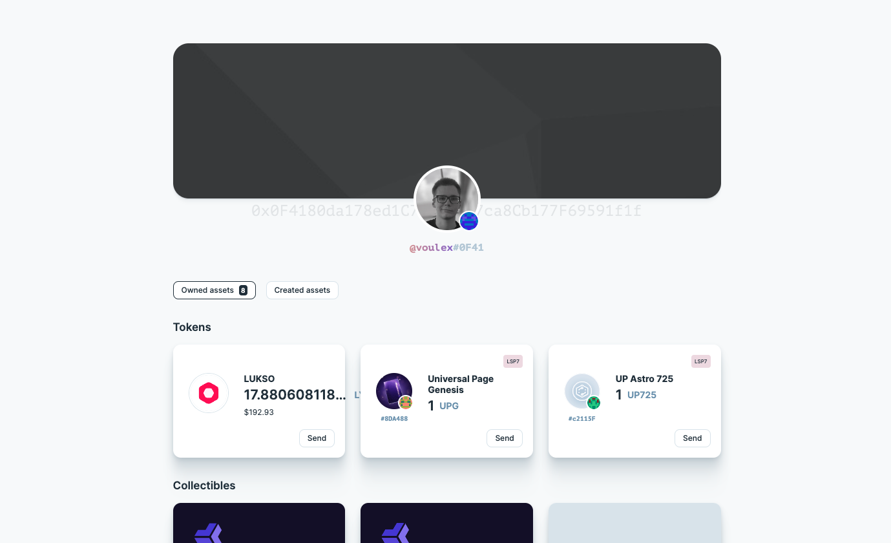
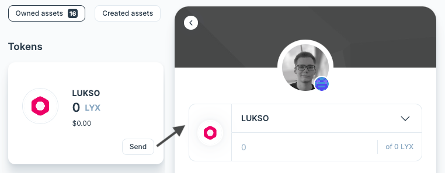
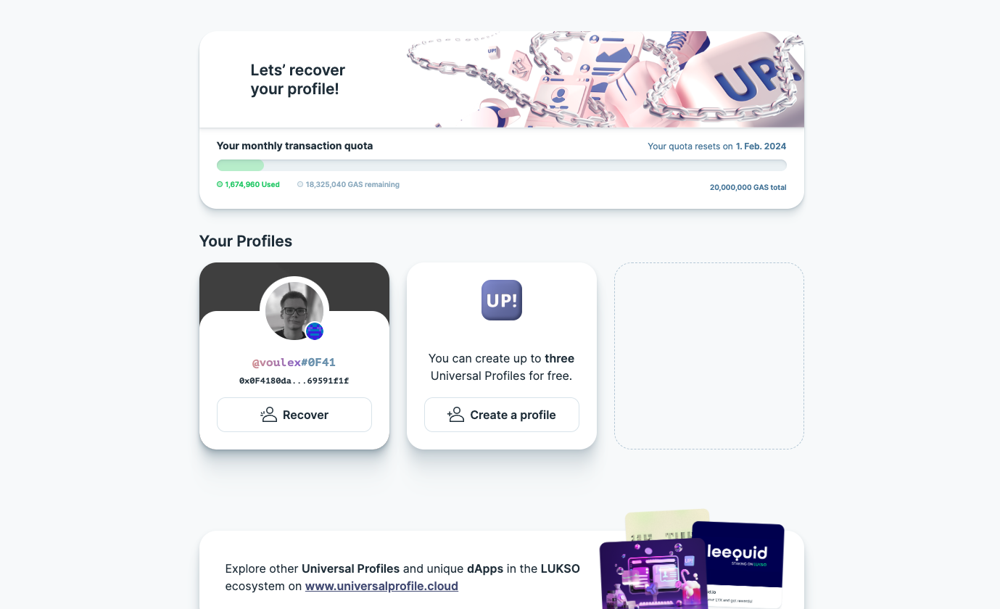

# Universal Profiles

## Where can I see my Universal Profile ?

You can find your Universal Profile on the Universal Profile Explorer at [universalprofile.cloud](https://universalprofile.cloud/). Just select the correct network on the bottom left corner and use the global search bar to search for your name.

## Where can I send assets of my Universal Profile?

The Universal Profile Extension **does not directly manage token information**. Instead, it is designed to work with various decentralized applications (dApps) that can seamlessly integrate with your Universal Profile and interact with its information and controllers. You can connect your Universal Profile to [wallet.universalprofile.cloud](https://wallet.universalprofile.cloud/) to send token transactions.

If you are logged in, you will also be able to transfer assets:

## Where can I manage my Universal Profile?

You can connect your Universal Profile to [my.universalprofile.cloud](https://my.universalprofile.cloud/) to manage recovery or create new profiles.

## Is my Universal Profile name unique?

The profile name displayed on platforms and services is retrieved from the metadata linked to the smart contract. Such metadata, images, or descriptions can be individually set when creating or updating the Universal Profile. Therefore, multiple users can choose similar names or pictures.

What is unique about a Universal Profile are its address and the identicon. The address is indicated with the first four characters behind the profile name. In case the first characters of the address should be similar or identical, the identicon further helps to distinguish them. The combination of attributes was done to allow complete customization without lacking authentication.

## Can I send Ether and Token from Ethereum to my Universal Profile?

You can't send any assets to the address if you do not deploy the Universal Profile on Ethereum. Users will lose their assets if they send them to other networks without having access to the controller key.

:::danger LYXe Transactions

You can not send aquired LYXe directly to your Universal Profile address, as LYXe is deployed on Ethereum, but Universal Profiles are deployed on LUKSO. Please migrate your LYXe to LYX first using the [LUKSO Migration Service](https://migrate.lukso.network/). For further details, please visit the [Migration Support](../migration/introduction.md) page.

:::

## Which tokens and coins can my UniversalProfile hold?

A Universal Profile can hold any asset on the same network it's deployed on. On LUKSO, the native coin is LYX. While native coins from other networks can't be held directly in Universal Profiles deployed on LUKSO, external services might also create token bridges for external assets.

## Can I control assets using Universal Profiles on any blockchain?

You can manage your assets through a Universal Profile on any blockchain the contract is deployed on. This would also include cases where the standardization was rewritten in a different language. If a service or project would allow you to create Universal Profiles on Ethereum, you could manage your assets through it.
