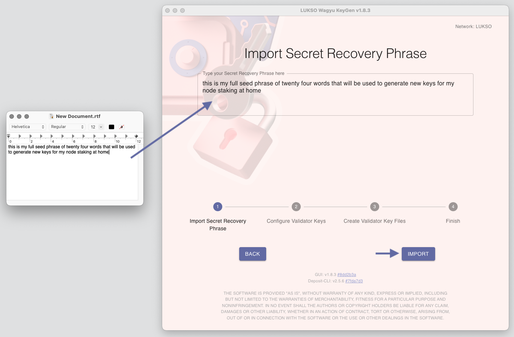

# Validators

## How to input my Validator Seed into the Wagyu Client?

:::caution

There is currently an issue when trying to type spaces within the [LUKSO Wagyu Keygen](https://github.com/lukso-network/tools-wagyu-key-gen) tool.

:::

If you are experiencing this issue, please write your _Validator Seed Phrase_ in a blank document, separated by spaces. Then **copy the full content** into the import screen of the [LUKSO Wagyu Keygen](https://github.com/lukso-network/tools-wagyu-key-gen) tool.

:::tip

Before continuing with the import, ensure all words are written correctly and in order.

:::
